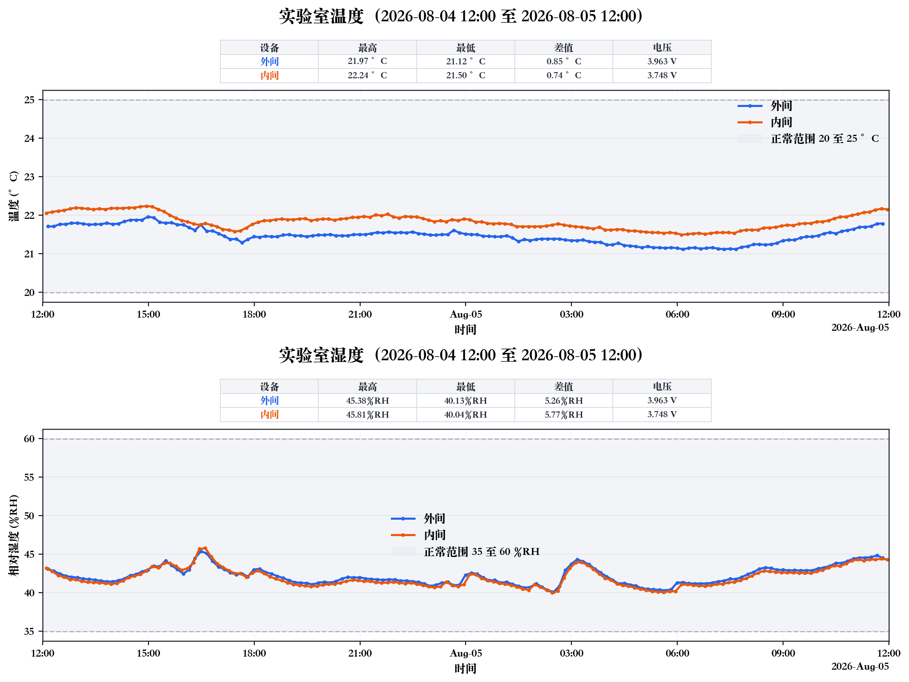

# CyberLab LabStat

106 实验室温湿度监测数据、图表和状态报告归档。默认统计窗口为 `Asia/Shanghai` 时区下前一日 `12:00:00` 至当日 `12:00:00`。

## 最新发布

- 时间窗口：`2026-08-04 12:00` 至 `2026-08-05 12:00`
- 发布类型：完整双设备发布
- 设备覆盖：`106-设备区`（外间）、`106-testing 5`（内间）
- 离线设备：无
- 数据范围：外间 `2026-08-04 12:09:15` 至 `2026-08-05 11:52:46`；内间 `2026-08-04 12:02:08` 至 `2026-08-05 11:58:35`
- 状态：`正常`
- 判定规则：当前规则，温度 `20–25 °C`、湿度 `35–60 %RH`，单项累计超限严格超过 `2 小时` 才判定不正常



> 实验室温湿度监测：正常。

[查看外间 CSV](<data/raw/106-设备区_raw_2026-08-04-12-00-00_to_2026-08-05-12-00-00.csv>) | [查看内间 CSV](<data/raw/106-testing 5_raw_2026-08-04-12-00-00_to_2026-08-05-12-00-00.csv>) | [查看状态报告](reports/lab_status_2026-08-04-12-00-00_to_2026-08-05-12-00-00.md)

## 最近完整双设备发布

- 时间窗口：`2026-08-04 12:00` 至 `2026-08-05 12:00`
- 设备覆盖：`106-设备区`（外间）、`106-testing 5`（内间）
- 状态：`正常`

[查看温湿度图](figures/temperature_humidity_2026-08-04-12-00-00_to_2026-08-05-12-00-00.png) | [查看状态报告](reports/lab_status_2026-08-04-12-00-00_to_2026-08-05-12-00-00.md)

## 历史归档

| 时间窗口 | 设备覆盖 | 发布类型 | 规则版本 | 状态 | 图表 | 报告 |
| --- | --- | --- | --- | --- | --- | --- |
| `2026-08-04 12:00` 至 `2026-08-05 12:00` | 外间、内间 | 完整双设备 | 当前规则 | 正常 | [PNG](figures/temperature_humidity_2026-08-04-12-00-00_to_2026-08-05-12-00-00.png) | [Markdown](reports/lab_status_2026-08-04-12-00-00_to_2026-08-05-12-00-00.md) |
| `2026-08-03 12:00` 至 `2026-08-04 12:00` | 外间、内间 | 完整双设备 | 当前规则 | 正常 | [PNG](figures/temperature_humidity_2026-08-03-12-00-00_to_2026-08-04-12-00-00.png) | [Markdown](reports/lab_status_2026-08-03-12-00-00_to_2026-08-04-12-00-00.md) |
| `2026-08-02 12:00` 至 `2026-08-03 12:00` | 外间、内间 | 完整双设备 | 当前规则 | 正常 | [PNG](figures/temperature_humidity_2026-08-02-12-00-00_to_2026-08-03-12-00-00.png) | [Markdown](reports/lab_status_2026-08-02-12-00-00_to_2026-08-03-12-00-00.md) |
| `2026-08-01 12:00` 至 `2026-08-02 12:00` | 外间、内间 | 完整双设备 | 当前规则 | 正常 | [PNG](figures/temperature_humidity_2026-08-01-12-00-00_to_2026-08-02-12-00-00.png) | [Markdown](reports/lab_status_2026-08-01-12-00-00_to_2026-08-02-12-00-00.md) |
| `2026-07-31 12:00` 至 `2026-08-01 12:00` | 外间、内间 | 完整双设备 | 当前规则 | 正常 | [PNG](figures/temperature_humidity_2026-07-31-12-00-00_to_2026-08-01-12-00-00.png) | [Markdown](reports/lab_status_2026-07-31-12-00-00_to_2026-08-01-12-00-00.md) |
| `2026-07-30 12:00` 至 `2026-07-31 12:00` | 外间、内间 | 完整双设备 | 当前规则 | 正常 | [PNG](figures/temperature_humidity_2026-07-30-12-00-00_to_2026-07-31-12-00-00.png) | [Markdown](reports/lab_status_2026-07-30-12-00-00_to_2026-07-31-12-00-00.md) |
| `2026-07-29 12:00` 至 `2026-07-30 12:00` | 外间、内间 | 完整双设备 | 当前规则 | 正常 | [PNG](figures/temperature_humidity_2026-07-29-12-00-00_to_2026-07-30-12-00-00.png) | [Markdown](reports/lab_status_2026-07-29-12-00-00_to_2026-07-30-12-00-00.md) |
| `2026-07-28 12:00` 至 `2026-07-29 12:00` | 外间、内间 | 完整双设备 | 当前规则 | 正常 | [PNG](figures/temperature_humidity_2026-07-28-12-00-00_to_2026-07-29-12-00-00.png) | [Markdown](reports/lab_status_2026-07-28-12-00-00_to_2026-07-29-12-00-00.md) |
| `2026-07-27 12:00` 至 `2026-07-28 12:00` | 外间、内间 | 完整双设备 | 当前规则 | 正常 | [PNG](figures/temperature_humidity_2026-07-27-12-00-00_to_2026-07-28-12-00-00.png) | [Markdown](reports/lab_status_2026-07-27-12-00-00_to_2026-07-28-12-00-00.md) |
| `2026-07-26 12:00` 至 `2026-07-27 12:00` | 外间、内间 | 完整双设备 | 当前规则 | 正常 | [PNG](figures/temperature_humidity_2026-07-26-12-00-00_to_2026-07-27-12-00-00.png) | [Markdown](reports/lab_status_2026-07-26-12-00-00_to_2026-07-27-12-00-00.md) |
| `2026-07-25 12:00` 至 `2026-07-26 12:00` | 外间、内间 | 完整双设备 | 当前规则 | 正常 | [PNG](figures/temperature_humidity_2026-07-25-12-00-00_to_2026-07-26-12-00-00.png) | [Markdown](reports/lab_status_2026-07-25-12-00-00_to_2026-07-26-12-00-00.md) |
| `2026-07-24 12:00` 至 `2026-07-25 12:00` | 外间、内间 | 完整双设备 | 当前规则 | 正常 | [PNG](figures/temperature_humidity_2026-07-24-12-00-00_to_2026-07-25-12-00-00.png) | [Markdown](reports/lab_status_2026-07-24-12-00-00_to_2026-07-25-12-00-00.md) |
| `2026-07-23 12:00` 至 `2026-07-24 12:00` | 外间、内间 | 完整双设备 | 当前规则 | 正常 | [PNG](figures/temperature_humidity_2026-07-23-12-00-00_to_2026-07-24-12-00-00.png) | [Markdown](reports/lab_status_2026-07-23-12-00-00_to_2026-07-24-12-00-00.md) |
| `2026-07-22 12:00` 至 `2026-07-23 12:00` | 外间、内间 | 完整双设备 | 当前规则 | 正常 | [PNG](figures/temperature_humidity_2026-07-22-12-00-00_to_2026-07-23-12-00-00.png) | [Markdown](reports/lab_status_2026-07-22-12-00-00_to_2026-07-23-12-00-00.md) |
| `2026-07-21 12:00` 至 `2026-07-22 12:00` | 外间、内间 | 完整双设备 | 当前规则 | 正常 | [PNG](figures/temperature_humidity_2026-07-21-12-00-00_to_2026-07-22-12-00-00.png) | [Markdown](reports/lab_status_2026-07-21-12-00-00_to_2026-07-22-12-00-00.md) |
| `2026-07-20 12:00` 至 `2026-07-21 12:00` | 外间、内间 | 完整双设备 | 当前规则 | 正常 | [PNG](figures/temperature_humidity_2026-07-20-12-00-00_to_2026-07-21-12-00-00.png) | [Markdown](reports/lab_status_2026-07-20-12-00-00_to_2026-07-21-12-00-00.md) |
| `2026-07-19 12:00` 至 `2026-07-20 12:00` | 外间、内间 | 完整双设备 | 当前规则 | 正常 | [PNG](figures/temperature_humidity_2026-07-19-12-00-00_to_2026-07-20-12-00-00.png) | [Markdown](reports/lab_status_2026-07-19-12-00-00_to_2026-07-20-12-00-00.md) |
| `2026-07-18 12:00` 至 `2026-07-19 12:00` | 外间、内间 | 完整双设备 | 当前规则 | 正常 | [PNG](figures/temperature_humidity_2026-07-18-12-00-00_to_2026-07-19-12-00-00.png) | [Markdown](reports/lab_status_2026-07-18-12-00-00_to_2026-07-19-12-00-00.md) |
| `2026-07-17 12:00` 至 `2026-07-18 12:00` | 外间、内间 | 完整双设备 | 当前规则 | 正常 | [PNG](figures/temperature_humidity_2026-07-17-12-00-00_to_2026-07-18-12-00-00.png) | [Markdown](reports/lab_status_2026-07-17-12-00-00_to_2026-07-18-12-00-00.md) |
| `2026-07-16 12:00` 至 `2026-07-17 12:00` | 外间、内间 | 完整双设备 | 当前规则 | 正常 | [PNG](figures/temperature_humidity_2026-07-16-12-00-00_to_2026-07-17-12-00-00.png) | [Markdown](reports/lab_status_2026-07-16-12-00-00_to_2026-07-17-12-00-00.md) |
| `2026-07-15 12:00` 至 `2026-07-16 12:00` | 外间、内间 | 完整双设备 | 当前规则 | 正常 | [PNG](figures/temperature_humidity_2026-07-15-12-00-00_to_2026-07-16-12-00-00.png) | [Markdown](reports/lab_status_2026-07-15-12-00-00_to_2026-07-16-12-00-00.md) |
| `2026-07-14 12:00` 至 `2026-07-15 12:00` | 外间、内间 | 完整双设备 | 当前规则 | 正常 | [PNG](figures/temperature_humidity_2026-07-14-12-00-00_to_2026-07-15-12-00-00.png) | [Markdown](reports/lab_status_2026-07-14-12-00-00_to_2026-07-15-12-00-00.md) |
| `2026-07-13 12:00` 至 `2026-07-14 12:00` | 外间、内间 | 完整双设备 | 当前规则 | 不正常 | [PNG](figures/temperature_humidity_2026-07-13-12-00-00_to_2026-07-14-12-00-00.png) | [Markdown](reports/lab_status_2026-07-13-12-00-00_to_2026-07-14-12-00-00.md) |
| `2026-07-12 12:00` 至 `2026-07-13 12:00` | 内间；外间离线 | 单设备正式降级 | 当前规则 | 正常 | [PNG](figures/temperature_humidity_2026-07-12-12-00-00_to_2026-07-13-12-00-00.png) | [Markdown](reports/lab_status_2026-07-12-12-00-00_to_2026-07-13-12-00-00.md) |
| `2026-07-11 12:00` 至 `2026-07-12 12:00` | 内间；外间离线 | 单设备正式降级 | 当前规则 | 正常 | [PNG](figures/temperature_humidity_2026-07-11-12-00-00_to_2026-07-12-12-00-00.png) | [Markdown](reports/lab_status_2026-07-11-12-00-00_to_2026-07-12-12-00-00.md) |
| `2026-07-10 12:00` 至 `2026-07-11 12:00` | 外间、内间 | 完整双设备 | 旧规则 | 不正常 | [PNG](figures/temperature_humidity_2026-07-10-12-00-00_to_2026-07-11-12-00-00.png) | [Markdown](reports/lab_status_2026-07-10-12-00-00_to_2026-07-11-12-00-00.md) |
| `2026-07-09 12:00` 至 `2026-07-10 12:00` | 内间 | 临时单设备 | 旧规则 | 不正常 | [PNG](figures/temperature_humidity_2026-07-09-12-00-00_to_2026-07-10-12-00-00.png) | [Markdown](reports/lab_status_2026-07-09-12-00-00_to_2026-07-10-12-00-00.md) |
| `2026-07-08 12:00` 至 `2026-07-09 12:00` | 外间、内间 | 完整双设备 | 旧规则 | 不正常 | [PNG](figures/temperature_humidity_2026-07-08-12-00-00_to_2026-07-09-12-00-00.png) | [Markdown](reports/lab_status_2026-07-08-12-00-00_to_2026-07-09-12-00-00.md) |

> `2026-07-12` 之前的归档状态保留发布时旧规则，不追溯修改历史报告或已发送消息。

## 仓库内容

- `data/raw/`：限定到对应发布窗口的 UbiBot CSV 数据
- `figures/`：温度和湿度合并图
- `reports/`：Markdown 状态结论和分析报告
- `scripts/visualize_temperature_humidity.py`：温湿度可视化脚本
- `scripts/analyze_lab_status.py`：按累计超限时长生成状态结论
- `scripts/lab_status_rules.py`：绘图和状态分析共用的判定规则

设备名称对应关系：

| UbiBot 设备名 | 图表名称 |
| --- | --- |
| `106-设备区` | 外间 |
| `106-testing 5` | 内间 |

## 当前判定规则与数据口径

- 以下规则自 `2026-07-12` 起生效。
- 时区固定为 `Asia/Shanghai`。
- 温度正常范围为 `20–25 °C`，湿度正常范围为 `35–60 %RH`，上下边界均计入正常范围。
- 按设备、按指标分别累计一天内超出正常范围的时长；任一项累计时长严格大于 `2 小时` 才判定为 `不正常`，恰好 `2 小时` 仍为正常。
- 每个有效读数的状态延续到下一有效读数，单段最多计 `30 分钟`；超过部分视为数据断档，不计入正常或异常时长。
- 汇报为正常时，结论固定为 `实验室温湿度监测：正常。`，不附加时间窗口或判定说明。
- 汇报为不正常时，结论列出异常设备和指标、连续超限时段、正常范围、累计超限时长及最高或最低异常值；相邻超限片段合并，正常读数或数据断档会分隔时段。
- 发布按实际有效设备覆盖范围归档：两台都有数据时为完整双设备发布；只有一台有数据时为单设备正式降级发布，并在结论、飞书消息和归档中标注另一台离线或目标窗口内无数据，不能代表双设备完整状态。
- `data/raw/` 中的发布 CSV 只保留 `START <= created_at <= END` 的数据行，绘图脚本也会按同一窗口再次过滤。
- CSV 使用 `created_at` 记录时间，`field1` 记录温度，`field2` 记录湿度，`field3` 在可用时记录电压。
- 文件名使用 `{设备名}_raw_{START}_to_{END}.csv`，时间格式为 `YYYY-MM-DD-HH-MM-SS`。

## 复现图表

依赖 Python 3 和 matplotlib。在仓库根目录执行：

```bash
MPLCONFIGDIR=/tmp/matplotlib python3 \
  scripts/visualize_temperature_humidity.py \
  --start "2026-07-09 12:00:00" \
  --end "2026-07-10 12:00:00" \
  --device "106-testing 5"
```

`--device` 可重复传入。省略该参数时，脚本默认读取外间和内间两台设备，适用于完整双设备发布。

本项目自动化在当前 Mac 上使用已验证的固定解释器：

```bash
MPLCONFIGDIR=/tmp/matplotlib \
  /Applications/Xcode.app/Contents/Developer/usr/bin/python3 \
  scripts/visualize_temperature_humidity.py \
  --start "2026-07-09 12:00:00" \
  --end "2026-07-10 12:00:00" \
  --device "106-testing 5"
```

## 生成状态结论

状态分析与绘图共用 `scripts/lab_status_rules.py` 中的范围和持续时间设置。在仓库根目录执行：

```bash
/Applications/Xcode.app/Contents/Developer/usr/bin/python3 \
  scripts/analyze_lab_status.py \
  --start "2026-07-11 12:00:00" \
  --end "2026-07-12 12:00:00"
```

脚本默认分析两台设备，并将一句话结论写入对应的 `reports/lab_status_{START}_to_{END}.md`。完整双设备正常时只写 `实验室温湿度监测：正常。`；异常时才附加超限时段和异常详情。单设备正式降级分析可重复使用 `--device` 参数，并用 `--offline-device` 标注离线设备。

## 公开仓库说明

本仓库保存公开的设备名称与 serial、实验室运行数据、图表、报告和绘图脚本。自动化执行说明、账号信息、密码、token、cookie 和本地配置文件不在本仓库中保存。

本仓库当前用于公开归档，尚未单独声明代码和数据的复用许可证。
