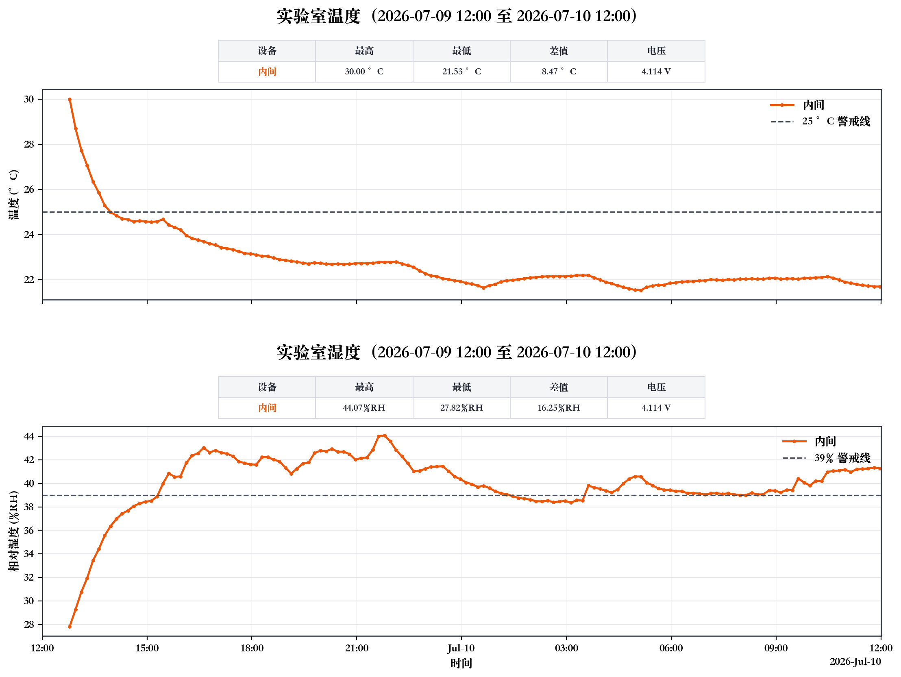

# CyberLab LabStat

106 实验室温湿度监测数据、图表和状态报告归档。默认统计窗口为 `Asia/Shanghai` 时区下前一日 `12:00:00` 至当日 `12:00:00`。

## 最新发布

- 时间窗口：`2026-07-09 12:00` 至 `2026-07-10 12:00`
- 发布类型：临时单设备发布，不代表双设备完整状态
- 设备覆盖：`106-testing 5`（图中标记为 `内间`）
- 数据范围：`2026-07-09 12:47:20` 至 `2026-07-10 11:58:27`
- 状态：`不正常`



> 实验室温湿度监测：不正常。2026-07-09 12:00 至 2026-07-10 12:00 期间，内间温度在 2026-07-09 12:47 达到 30.00 °C，超过 25 °C 警戒线；内间湿度在 2026-07-09 21:47 达到 44.07 %RH，超过 39 %RH 警戒线。

[查看原始 CSV](<data/raw/106-testing 5_raw_2026-07-09-12-00-00_to_2026-07-10-12-00-00.csv>) | [查看状态报告](reports/lab_status_2026-07-09-12-00-00_to_2026-07-10-12-00-00.md)

## 最近完整双设备发布

- 时间窗口：`2026-07-08 12:00` 至 `2026-07-09 12:00`
- 设备覆盖：`106-设备区`（外间）、`106-testing 5`（内间）
- 状态：`不正常`

[查看温湿度图](figures/temperature_humidity_2026-07-08-12-00-00_to_2026-07-09-12-00-00.png) | [查看状态报告](reports/lab_status_2026-07-08-12-00-00_to_2026-07-09-12-00-00.md)

## 历史归档

| 时间窗口 | 设备覆盖 | 发布类型 | 状态 | 图表 | 报告 |
| --- | --- | --- | --- | --- | --- |
| `2026-07-09 12:00` 至 `2026-07-10 12:00` | 内间 | 临时单设备 | 不正常 | [PNG](figures/temperature_humidity_2026-07-09-12-00-00_to_2026-07-10-12-00-00.png) | [Markdown](reports/lab_status_2026-07-09-12-00-00_to_2026-07-10-12-00-00.md) |
| `2026-07-08 12:00` 至 `2026-07-09 12:00` | 外间、内间 | 完整双设备 | 不正常 | [PNG](figures/temperature_humidity_2026-07-08-12-00-00_to_2026-07-09-12-00-00.png) | [Markdown](reports/lab_status_2026-07-08-12-00-00_to_2026-07-09-12-00-00.md) |

## 仓库内容

- `data/raw/`：限定到对应发布窗口的 UbiBot CSV 数据
- `figures/`：温度和湿度合并图
- `reports/`：Markdown 状态结论和分析报告
- `scripts/visualize_temperature_humidity.py`：温湿度可视化脚本

设备名称对应关系：

| UbiBot 设备名 | 图表名称 |
| --- | --- |
| `106-设备区` | 外间 |
| `106-testing 5` | 内间 |

## 判定规则与数据口径

- 时区固定为 `Asia/Shanghai`。
- 温度上限为 `25 °C`，湿度上限为 `39 %RH`。
- 任一已覆盖设备的任一有效温度点大于 `25 °C`，或任一有效湿度点大于 `39 %RH`，状态即为 `不正常`；等于警戒线不算超限。
- 完整发布必须覆盖外间和内间；缺少任一设备时只能标记为临时单设备发布，不能代表双设备完整状态。
- `data/raw/` 中的发布 CSV 只保留 `START <= created_at <= END` 的数据行，绘图脚本也会按同一窗口再次过滤。
- CSV 使用 `created_at` 记录时间，`field1` 记录温度，`field2` 记录湿度，`field3` 在可用时记录电压。
- 文件名使用 `{设备名}_raw_{START}_to_{END}.csv`，时间格式为 `YYYY-MM-DD-HH-MM-SS`。

## 复现图表

依赖 Python 3 和 matplotlib。在仓库根目录执行：

```bash
MPLCONFIGDIR=/tmp/matplotlib python3 \
  scripts/visualize_temperature_humidity.py \
  --start "2026-07-09 12:00:00" \
  --end "2026-07-10 12:00:00" \
  --device "106-testing 5"
```

`--device` 可重复传入。省略该参数时，脚本默认读取外间和内间两台设备，适用于完整双设备发布。

本项目自动化在当前 Mac 上使用已验证的固定解释器：

```bash
MPLCONFIGDIR=/tmp/matplotlib \
  /Applications/Xcode.app/Contents/Developer/usr/bin/python3 \
  scripts/visualize_temperature_humidity.py \
  --start "2026-07-09 12:00:00" \
  --end "2026-07-10 12:00:00" \
  --device "106-testing 5"
```

## 公开仓库说明

本仓库保存公开的设备名称与 serial、实验室运行数据、图表、报告和绘图脚本。自动化执行说明、账号信息、密码、token、cookie 和本地配置文件不在本仓库中保存。

本仓库当前用于公开归档，尚未单独声明代码和数据的复用许可证。
