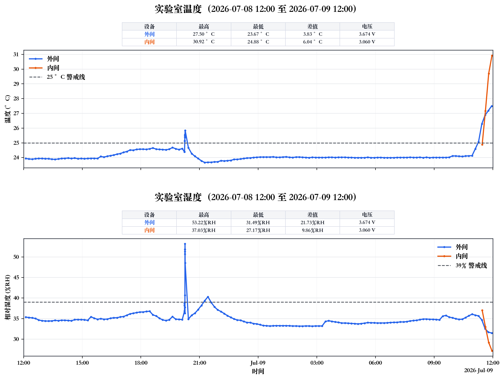

# CyberLab LabStat

106 实验室温湿度监测数据、图表和状态报告归档。

## 内容

- `data/raw/`：UbiBot 原始 CSV 导出数据
  - `106-设备区`：图中标记为 `外间`
  - `106-testing 5`：图中标记为 `内间`
- `figures/`：温度和湿度合并图
- `reports/`：Markdown 状态结论和分析报告
- `scripts/visualize_temperature_humidity.py`：温湿度可视化脚本

## 当前数据窗口

- 时间范围：`2026-07-08 12:00` 至 `2026-07-09 12:00`
- 时区：`Asia/Shanghai`
- 温度警戒线：`25 °C`
- 湿度警戒线：`39%RH`



当前一句话结论：

> 实验室温湿度监测：不正常。2026-07-08 12:00 至 2026-07-09 12:00 期间，外间温度在 2026-07-09 11:56 达到 27.50 °C，超过 25 °C 警戒线；外间湿度在 2026-07-08 20:15 达到 53.22 %RH，超过 39 %RH 警戒线；内间温度在 2026-07-09 11:57 达到 30.92 °C，超过 25 °C 警戒线。

## 复现图表

```bash
cd /Users/binbin/Desktop/CyberLab_LabStat
MPLCONFIGDIR=/tmp/matplotlib scripts/visualize_temperature_humidity.py
```

脚本使用本机固定 Python 路径：

```text
/Applications/Xcode.app/Contents/Developer/usr/bin/python3
```

依赖：

- Python 3
- matplotlib

## 公开仓库说明

本仓库只保存公开的数据、图表、报告和绘图脚本。自动化执行说明、账号信息、token、cookie 和本地配置文件不在本仓库中保存。
